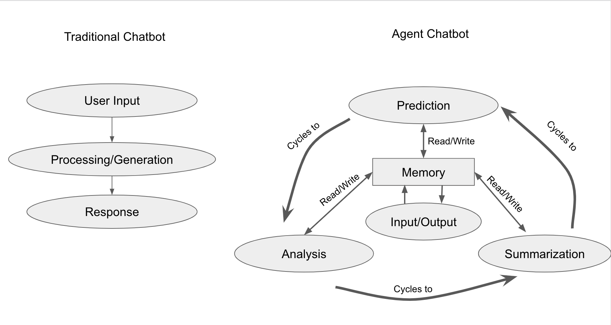

### Agent-Chatbot

Here's a youtube demo! 

[](https://www.youtube.com/watch?v=kVbxkm4sq3w)


Hmm, so I might have thought this was doing better than it was. I do want to move it to v3 though, turns out the different parts of the cycle weren't doing as well as I thought so had to go in and mess with them. For some reason it doesn't like to parse the input object without knowing what it is (and potentially that was an issue, i set the output limit to 500 tokens to save on compute and that might have been too little? But also when playing with it after the fact realized the planner parser kind of wasn't doing what I wanted.) I think the planning is somewhat fixed now but definitely need to go in and brain surgery why it isn't picking up on the format the way it's supposed to - I've been using TypeScript interfaces elsewhere for formats and it normally works fine, although possibly it has to do with a string:list comparison or something and that's gunking things up. Anyway, seems to be back to kind of working, can do poems again, but ASDF these are a pain to get consistent.

This chatbot does a couple things that might be interesting. First, the prompts are kind of cool - it utilizes text-davinci-003's ability to guess code output well (see https://engineering.hyperwriteai.com/hallucinating-functions-for-chat for more on that). Also, instead of just call-response like a normal chatbot, it has a persistant state and just edits it. This can probably be built out a lot and that's probably interesting.

One of the things many people have found with GPT is it does better when it thinks through a problem. E.g. in the original GPT paper, they thought it couldn't do better than chance on Word in Context, but it turns out if you have it do intermediary steps it can. Additionally, chunking information into sections via summarization can help - although what chunking means is a bit ambiguous. For instance, if you have n-digit integer arithmetic, chunking it into sections with commas improves it but is that chunking or something else? I don't know. But it's interesting.

Anyway, this is kind of a step in playing with these concepts in a persistent agent and I'm sure there's going to be a lot more things like this now that the tech is widely available.

### what's this self awareness thing

So there was this tweet, https://twitter.com/goodside/status/1610879587319177216, about self awareness and i realized i didn't know what it was or if it was important, so figured i'd make this repo to figure out wtf it was and what happened if we gave it to an agent.

So I don't know all that much about what self awareness means, but i figure that we can see what it looks like for something to be aware of it's own thoughts by having an agent that;
1) has a thought-state
2) has some function F that evaluates that thought state
3) F is able to put into that thought-state that F has evaluated that thought state

I don't particularly expect anything crazy to emerge out of this (and particularly, i suspect that people think the emerging self awareness is the intersting bit not forcing it in like this) but i figure it's worth playing with to try to figure out what it even looks like and how it works.

### Lessons Learned

I went through 2 iterations of this, probably going to iterate to a third on some of the lessons learned. What this ends up doing is it has a thought cycle that's constantly evaluating what's going on. Whenever the user sends input, it just adds to the thought cycle that the user told it something and then it can eventually decide to do something about it.

in v1, everything was just updating a single state, but it was hard to get it to do anything interesting. In v2, there's a traditional chatbot history, of 
[thought, thought, thought]. This allows it to track what's happened somewhat, but the problem is there's still a bit too much hallucination between what it actually told the user and what it thinks it wants to tell the user. I suspect for v3 I need to break it down more for multiple queues, where there's
{
  currentThough: str,
  thoughtHistory: str[],
  interactionHistory: str[]
}
and this might help with some of the hallucination.

###

Edit 6 March - threw in GPT4 upgrade and it works out of the box now

### Cool prompt stuff
So the coolest thing about the prompt is hallucinated functions work _really really well_. Huge fan of using typescript interfaces to define specific outputs - see `linearPlanner.tsx` for the most interesting one i think.

So it turns out these hallucinated functions aren't as resiliant as I thought they were and the inputs do matter a lot, I think there's some work to do in figuring out when they do what's expected and when they don't. It ended up needing examples (ick, few shots) and then overfitting to one or two so had to go with 3. I suppose drinking 10 red bulls was not the best idea in the world.

#### important!
I don't know typescript that well so this should be fun

### Requirements

- Node.js and npm

### Getting started

Run the following command on your local environment:

```
npm install
```

Then, you can run locally in development mode with live reload:

```
npm run dev
```
